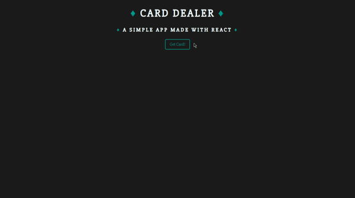

<h1 align="center">Card Dealer</h1>
<h4 align="center">
   
</h4>

  <a href="#wrench-built-with">Built With</a>&nbsp;&nbsp;&nbsp;|&nbsp;&nbsp;&nbsp;
  <a href="#-about">About</a>&nbsp;&nbsp;&nbsp;|&nbsp;&nbsp;&nbsp;
  <a href="#video_game-how-to-play">How to play</a>&nbsp;&nbsp;&nbsp;|&nbsp;&nbsp;&nbsp;
  <a href="#-how-to-contribute">How to Contribute</a>&nbsp;&nbsp;&nbsp;|&nbsp;&nbsp;&nbsp;
  <a href="#pencil-author">Author</a>

## :wrench: Built With

- [React](https://reactjs.org)
- [Axios](https://www.npmjs.com/package/axios)

## 💻 About

This is a simple application built with ReactJS that can be used as a game. I'm learning how to deal with React and by doing this app
I managed to understand how to deal with API Requests by using axios.

## :video_game: How to Play

- Clone the project: `git clone https://github.com/Lukazovic/card-dealer-react-app.git`;
- Go to the project folder: `cd card-dealer-react-app`;
- Download the dependencies: `npm install`;
- Start the application: `npm start`.

It will open a browser page (if it doesn't, go to [http://localhost:3000](http://localhost:3000/)). 
Then you can start playing. Good luck!

## 🤔 How to Contribute

- Fork this repository;
- Create your branch with your feature: `git checkout -b my-feature`;
- Commit your feature: `git commit -m 'feat: My new feature'`;
- Push to your branch: `git push origin my-feature`.

Then merge your pull request, you can now delete your branch

## :pencil: Author

<table>
  <tr>
    <td align="center"><a href="https://github.com/Lukazovic"> <b>Lucas Vieira</b></a> </td>
  <tr>
</table>
